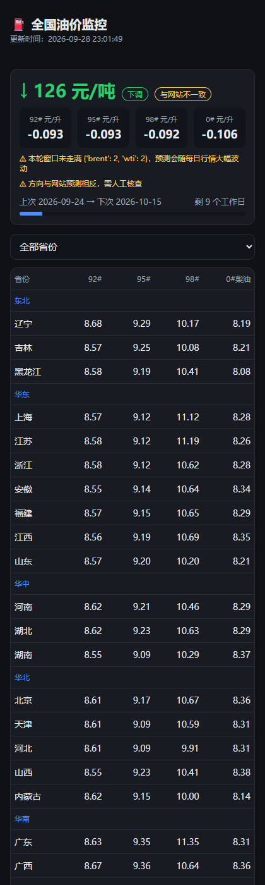

# ⛽ OilPriceWatch · 全国油价监控

> 国内成品油每 10 个工作日调一次价 —— 这是**确定性计算**，不是预测原油走势。

自算三地原油均价变化率，推算出下轮调价幅度与调价日期，并与数据源的预测值**交叉验证**。
覆盖 31 个省级行政区的 92# / 95# / 98# / 0# 零售价，H5 + Telegram Bot。

**在线：已自建部署，地址不在仓库中公开**



## 它是怎么算的

国内成品油**不跟随国际原油实时波动**。发改委每 10 个工作日比较一次
「本轮三地原油均价 vs 上一轮均价」，变化率对应的幅度 **≥ 50 元/吨才调价，否则搁浅**。

所以本项目做的是**确定性推算**：

| 输出 | 说明 |
|---|---|
| 下轮幅度 | 自算变化率 → 元/吨，并折算成看得懂的元/升（92# / 95# / 98# / 0#） |
| 下次调价日 | 从锚点按 10 个工作日递推，计入法定节假日与调休补班 |
| 是否搁浅 | 幅度不足 50 元/吨判为搁浅 |
| 一致性 | 与汽油价格网的预测值交叉验证；方向相反或幅度偏差 ≥ 50% 时**明确告警而非静默** |

> **交叉验证的口径**：网站有时直接给「元/吨」，有时只给「元/升」区间
> （如「目前预计上涨 0.30 元/升-0.36 元/升」）。后者按 92# 汽油的吨升比取中值
> **折算回元/吨**再比，界面上会标明「由元/升折算」——不会把折算值冒充成网站原文。
> 连幅度都拿不到时一律标「无法判定」，**绝不放行成「一致」**。

⚠️ **已知偏差来源**：新浪没有迪拜、米纳斯原油行情，只能用布伦特 + WTI + 上海原油近似"三地"。
这正是必须做交叉验证的原因。

⚠️ **周期刚开始时**本轮样本很少，算出来的变化率会剧烈摆动。此时页面会挂出
「本轮窗口未走满」的告警 —— 别把那个数字当真。

**它不做的**：不预测国际原油走势，不构成任何投资或消费决策依据。

## 功能

- **H5**：31 省油价一览、调价倒计时进度条、自动定位所在省、PWA 可添加到主屏幕离线查看
- **Telegram Bot**：`/oil_start [省份]` 订阅；**每天 8:00 推一次当日油价走向**，新一轮调价窗口开启时另有一次提醒，都附带你所在省的实时油价
- **定时刷新**：每 30 分钟打一次上游并落 SQLite 缓存；访客只读缓存，不会穿透到上游
- **CLI**：一条命令输出全国油价 + 预测，支持 `--json`
- **自动定位**：浏览器定位（HTTPS 下）优先，坐标**在本机**换算成省份；退回 IP 推断

## 🔴 机器人是共用的 —— 改 bot 前必读

线上这个 bot 的 token **与 tg-assistant 等项目共用**（就是那个通知机器人）。
共用意味着两条硬约束，`app/bot.py` 开头也有同样的注释：

1. **命令面独占命名空间**。所有命令都带 `/oil` 前缀，**匹配不到就完全沉默** ——
   不回「未知命令」、不回欢迎语、不做任何默认话术。
   踩过的坑：`/status` 是 tg-assistant 的命令，本项目曾用一段油价欢迎语把它抢答了。

   | 命令 | 作用 |
   |---|---|
   | `/oil_today` | 现在往哪走（今日走向，随时可查） |
   | `/oil_start` / `/oil_start 浙江` | 订阅每日走向（可同时指定省份），**任何场合都生效** |
   | `/oil_province 浙江` | 改省份，**任何场合都生效** |
   | `/oil_stop` | 退订 |
   | `/oil_help`（或 `/oil`） | 说明 |
   | 私聊里直接发「浙江」 | **先回一句「要订阅【浙江】的每日油价走向吗？」**，回复「是」才订阅 |
   | 群里直接发「浙江」 | **完全沉默**（不回复、不订阅、不记待办） |

   🔴 **纯省份名为什么只在私聊认、还要多问一句**：这个 bot 与别的项目共用，任何用户
   随手发一句「北京」都会被**静默订阅**、并从次日起每天 8:00 收到油价推送 ——
   在共用 bot 上这是越界的打扰，而且对方从没表达过订阅意愿。所以：
   - 纯省份名**只当意图**，落进 `pending_subscriptions` 表，不写 `subscribers`；
   - **群里一律不认**（`chat.type != private` 直接返回 `None`）。群里那句话很可能是
     别人的对话，接过去就是抢答；要订阅请用显式命令 `/oil_start 浙江`。
   - 只有回「是」才真订阅（「否」取消）；**没有本项目待办时「是/否」一律沉默** ——
     别人的对话里出现「是」太常见，不能接话。确认词只认孤立短词，
     「是的我在北京」这种闲聊不算；`chat.type` 字段缺失时按**群聊**处理（最保守）。

   别的项目的命令（`/status` `/start` `/help`…）与任意闲聊**一律不回应**，
   连日志都只打 debug。

2. **绝不碰按 token 全局唯一的状态**。
   - 轮询**永远不传 `offset`**：offset 是全局确认水位，传了就会把别的项目该收到的
     更新一并确认掉。代价是 Telegram 会反复返回同一批未确认更新，本项目在本地按
     `update_id` 去重（落 `settings`，重启不重复回复）并在没有新消息时退避。
   - 🔴 **`allowed_updates` 也绝不能传**(2026-10-02 实测踩到)。它看起来只是
     「本次只收某几类更新」,但 Telegram 会把它写成**按 token 全局且持久**的订阅设置:
     `getWebhookInfo` 的 `allowed_updates` 字段会跟着变,而且**之后不传该参数并不会恢复**
     (传 `["callback_query"]` ⇒ 全局变成 `["callback_query"]`;再不带参数调用,全局仍是它)。
     那会静默掐掉别的项目/将来新增场景的更新类型,且极难排查。
   - 这个 bot 同时是 tg-assistant 通知频道 `Notify` 的成员,频道每发一条就产生一条
     `channel_post`,会把 `getUpdates` 的一页(上限 100 条)占满 —— 这是**预期噪音,
     不能靠全局过滤去消除**。实测(2026-10-02,含独立复核):抽取的历史日志里
     **68% 的页面正好取满 100 条** ⇒ 队列长期贴着上限。此时被截掉的是**最新**的更新
     (getUpdates 从最老未确认开始返回),所以命令**不是收不到,而是延迟**:要等更老的
     更新 24 小时过期腾出位置(典型十几分钟,突发时可达数小时,最坏接近 24h)。
     注意别用单次 `pending_update_count` 采样下结论——当天 15 次低谷采样是 93~97,
     不代表常态;要看长期分布。
     这个积压提示**只在进程内第一次打 WARNING、之后每小时最多一条 INFO**
     (曾经每轮都打,4 天刷了 63896 行日志)。
   - 想要**彻底消除这个延迟**,有且只有一个开关:`OILWATCH_TG_ALLOW_OFFSET=1`
     (见 `app/bot.py::_offset_enabled`)。它会让轮询推进确认水位 ⇒ 积压被清空、
     长轮询真正生效(命令秒级可达)。**前提是确认这个 token 上没有别的项目在用
     Bot API 的 getUpdates**(线下的 tg-assistant 走 pyrogram/MTProto 用户账号转发,
     不受影响)。默认关闭。
   - ⚠️ **还原 `allowed_updates` 的判据陷阱**:官方文档写明该参数
     "doesn't affect updates created before the call",而本项目**从不确认**任何更新
     ⇒ 老积压永远算「调用之前创建的更新」⇒ **无论过滤是否生效,`channel_post` 都会照常返回**。
     所以「还原后又能收到 channel_post 了」**不构成**还原成功的证据;唯一有效判据是
     `getWebhookInfo.allowed_updates` 是否回到缺失/空。还原写法:传 `allowed_updates=[]`。
   - ⚠️ 排查时**不要一边跑服务一边手工 `getUpdates`**:同一 token 上并发调用会互相抢页,
     实测并发 3 个请求时出现过 `(99, 1, 1)` —— 落单者只拿到最老那一条。
   - `set_webhook()` / `delete_webhook()` **默认拒绝执行**（会掐断别人的 getUpdates），
     需显式设 `OILWATCH_TG_ALLOW_WEBHOOK=1` 才放行。
   - `sendMessage` 这类发送接口不动全局状态，正常使用。

## 📣 推送有两条，都靠「送达后才落幂等键」

| 推送 | 时机 | 幂等键 |
|---|---|---|
| 每日油价走向 | 每天 `OILWATCH_TG_DAILY_HOUR`（默认 8 点）之后一次 | `settings.tg_last_daily_date` |
| 新一轮调价窗口开启 | `window.next_date` 变化时一次 | `settings.tg_last_cycle_next` |

🔴 **幂等键只在真的送出去之后才落**（`sent > 0`）。反过来写（先落键再发送）会踩到一个
真实事故：2026-09-28 21:43 那次周期推送时**还没有任何订阅者**，键却被写下了，
用户 22:16 才订阅，于是接下来 17 天一条推送都收不到。
现在没送出去就不落键 ⇒ 每 30 分钟的巡检会**自动补推**，既不会静默度过一轮/一天，
也不会重复发。服务重启、错过 8 点同样会自动补上当天的走向。

两点必须说清的边界（独立复核时被指出，已加告警/文档）：

- `sent > 0` 的准确含义是「**至少**成功送出一个」。N 个订阅者只成功 1 个时，其余订阅者
  当天就静默丢了 —— 落键前会打一条 WARNING（`每日油价走向部分失败：1/2 …`），
  别让「部分失败」和「全部成功」在日志上长得一样（这正是 9/28 事故难以发现的同款盲区）。
- 落键是 `broadcast()` **返回之后**才写的：若进程恰好在这不到 1 秒的窗口里被杀
  （`Restart=always`），下次巡检会重发一次 ⇒ 极小概率重复。
- 整日不发的情况：整日停机（次日不补当天）、整日拿不到 `window`、没配 token、
  或当天所有订阅者都发送失败（此时保持待发，下一个巡检重试）。

## 快速开始

```bash
python -m venv venv
source venv/bin/activate        # Windows: venv\Scripts\activate
pip install -r requirements.txt

# 只看数据，不起服务
python -m app.cli
python -m app.cli --json
python -m app.cli --anchor 2026-09-24    # 指定上次真实调价日，调价窗口更准

# 起 H5 + API
uvicorn app.main:app --host 0.0.0.0 --port 8010
```

然后打开 <http://127.0.0.1:8010>。

## 配置

所有密钥都从环境变量读（示例见 `deploy/.env.example`）。**一个都不配也能跑** ——
Bot 会静默跳过，管理接口在未设 token 时放行（仅适合本地调试）。

| 变量 | 说明 |
|---|---|
| `OILWATCH_TG_BOT_TOKEN` | Telegram Bot Token（@BotFather）。留空则 Bot 功能整体关闭 |
| `OILWATCH_TG_WEBHOOK_URL` | 配了就走 Webhook（需公网 HTTPS），否则走 Polling |
| `OILWATCH_TG_WEBHOOK_SECRET` | Webhook 校验密钥，可选但推荐 |
| `OILWATCH_TG_ALLOW_WEBHOOK` | 共用 bot 上**默认不设**：设成 `1` 才允许 `setWebhook`/`deleteWebhook`（会掐断别的项目） |
| `OILWATCH_TG_DAILY_HOUR` | 每日油价走向的推送时间（小时，Asia/Shanghai），默认 `8`。改完重启生效 |
| `OILWATCH_TG_ALLOW_OFFSET` | 设 `1` 才允许轮询推进 offset（清空积压、命令秒级可达）。**默认关闭**；打开前必须确认该 token 上没有别的项目用 Bot API getUpdates |
| `OILWATCH_TG_POLL_IDLE_SLEEP` | 轮询没有新消息时的退避秒数，默认 `2.0`。共用 bot 上别调太小（不推进 offset ⇒ 老更新会被反复取回） |
| `OILWATCH_ADMIN_TOKEN` | 保护 `/api/refresh` 与改锚点接口 |
| `OILWATCH_LOG_LEVEL` | 日志级别，默认 `INFO` |
| `OILWATCH_TLS_INSECURE` | **仅本机沙箱调试**用，部署到服务器后**不要设** |

## 部署

推荐 **systemd + 主机 venv**：`deploy/oilwatch.service`、`deploy/nginx-oilwatch.conf`。

🔴 **必须单 worker**。APScheduler 和 Telegram polling 线程都是**进程内单例**，
多 worker 会让每个实例各刷一次上游、各推一次消息，重复打扰用户。

Docker 方式（`Dockerfile` / `docker-compose.yml`）也保留着，普通服务器上可以直接用。
我自己的服务器上改走 systemd，是因为 iptables 的 `DOCKER` 链里有自定义 `DROP` 规则，
新容器发布的端口会被拦掉。

### HTTPS 是刚需，不是可选项

浏览器定位属于「强力功能」，**只在安全上下文（HTTPS 或 localhost）下可用** ——
`http://` 页面上 Chrome / Safari / Firefox 都会直接拒绝，连授权框都不会弹。
Service Worker（PWA 离线）同理。`deploy/nginx-oilwatch.conf` 里已给好 certbot 的配置。

## 数据来源

| 来源 | 用途 |
|---|---|
| [汽油价格网](http://www.qiyoujiage.com) | 各省零售价、网站预测值 |
| 新浪财经 | 国际原油实时行情与日 K（布伦特 / WTI / 上海原油 / 美元人民币） |
| ip-api.com | **仅在你未授权浏览器定位时**用于推断省级位置 |
| Apache ECharts 4.9.0 `map/json/china.json` | 省级行政边界，点落多边形判省，坐标在本机换算 |

## 项目结构

```
app/
  main.py          FastAPI 入口与路由
  config.py        省份表、数据源地址、调价参数
  collector.py     抓取 → 落库（所有"打上游"的动作都收口在这里）
  db.py            SQLite 缓存（快照 / settings / 订阅者）
  bot.py           Telegram Bot（直接用 httpx 调 API，不引框架）
  scheduler.py     APScheduler 定时刷新
  geolocate.py     IP → 省份
  net.py           HTTP 客户端封装（代理 / 编码 / 重试）
  engine/
    window.py      10 工作日窗口推算
    holidays.py    2025 / 2026 法定节假日与调休
    forecast.py    变化率 → 调价幅度 + 交叉验证
  sources/
    qiyoujiage.py  各省零售价与网站预测
    sina.py        国际原油行情与日 K
static/            H5（geo.js 定位判定 + provinces.js 省级边界数据）
tools/             边界数据生成器（带 41 个城市用例自校验）
tests/             单测
deploy/            systemd / nginx / .env 示例
```

## 测试

```bash
pytest tests/ -q      # 139 passed
```

覆盖调价窗口推算与节假日、预测文案解析与方向归一化、省份判定（41 个城市用例，
并用 node 与 Python 参考实现对拍防漂移）、DB 连接关闭与订阅省份不被清空、
以及共用 bot 的两条隔离约定（命令白名单 + 轮询不推进 offset）——后者做过缺陷注入，
把旧行为换回去必定变红。

## 免责声明

个人自用工具。数据来自第三方公开源，准确性以各数据源为准。
调价预测是按公开调价机制做的推算，**不构成任何决策依据**，请以发改委正式通知为准。
